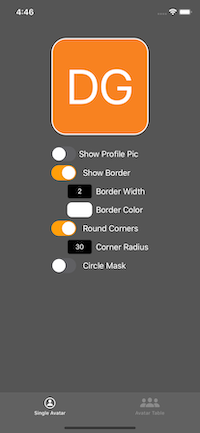
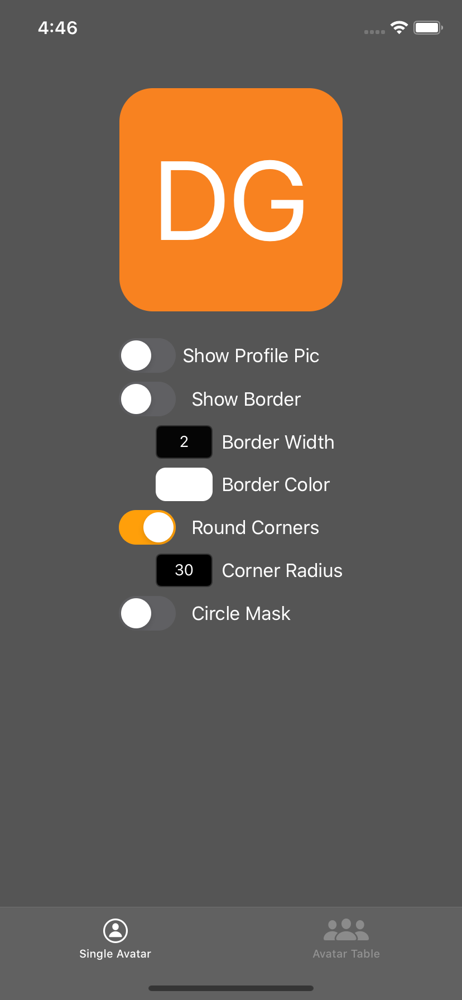
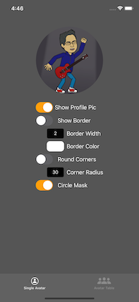

[](https://opensource.org/licenses/mit-license.php)
[](https://developer.apple.com/swift)


NDAvatarView is a framework for displaying profile pictures or user initials in a consistent way. 

#### Build Status

| Branch  | Build Status |
| ------------- | ------------- |
| Develop  | [](https://travis-ci.org/ayushn21/AvatarImageView)|
| Master  | [](https://travis-ci.org/ayushn21/AvatarImageView)|

## Description

`NDAvatarView` is a framework combining an instance of `AvatarImageView` with custom UI options for more flexibiity.

         

`AvatarImageView` is a customisable subclass of UIImageView that is designed to show users' profile pictures. It falls back to the user's initials with a random background color if no profile picture is supplied.

`UIViewX` is a UiView extension allowing IBDesigable options for border width, border color, corner radius, and other customizations.


## Usage

THIS IS NOT UP TO DATE FROM HERE OUT

To set up `AvatarImageView`, a `dataSource` that conforms to `AvatarImageViewDataSource` needs to be set. Optionally a `configuration` that conforms to `AvatarImageViewConfiguration` can also be set. The default configuration will show a square picture; and if no profile picture is supplied, it will draw the initials with the system font on a random background color.

The `AvatarImageViewDataSource` contains the following members. All have default implementations and are hence optional.

* `var name: String { get }` - Default: returns `""`
* `var avatar: UIImage? { get }` - Default: returns `nil`
* `var bgColor: UIColor? { get }` - Default: returns `nil` 
* `var initials: String { get }` - Default: returns initials calculated from the name.
* `var avatarId: Int { get }` - Default: returns the hash values of the name and initials combined using XOR.

The `AvatarImageViewConfiguration` contains the following members. All have default implementations and are hence optional.

* `var shape: Shape { get }` - Default: returns `.Square`
* `var textSizeFactor: CGFloat { get }` - Default: returns `0.5`
* `var fontName: String? { get }` - Default: returns `nil` 
* `var bgColor: UIColor? { get }` - Default: returns in`nil`. The `bgColor` in `AvatarImageViewDataSource` will take precedence over this one.
* `var textColor: UIColor { get }` - Default: returns `.white`.

Check out the [docs](http://cocoadocs.org/docsets/AvatarImageView/) for more information.

The random background colour is generated for each unique user from its `avatarId`, so if you have `AvatarImageView`s in different parts of your app, the background color for a particular user will be the same in both.

The image view can be drawn as a square or circle out of the box. You can even sepcify a mask image if you want a custom shape. These settings are done in an `AvatarImageViewConfiguration`. Here are some examples for initials being drawn in different shapes.


Here's an example of when the `dataSource` supplies a profile picture and the `configuration` is set to a circle.


It works great with custom fonts!


...and also with `UITableView`s


#### Example Project

Please refer to the example project in this repository for an implementation of all the above use cases. If you find any bugs, open a GitHub issue!

#### Gotchas

1. Always set the `configuration` before the `dataSource`. If you don't, you will need to manually call `refresh()` to render the view correctly.

2. When implementing the `AvatarImageViewDataSource` and `AvatarImageViewConfiguration` protocols, you will need to explicitly define the type for any protocol member that is an optional otherwise Swift goes insane.

For example, `AvatarImageViewConfiguration` has a type called `var fontName: String?` that returns `nil` by default. To implement this in a `struct`, define it as follows:

```swift
struct Config: AvatarImageViewConfiguration {
    var fontName: String? = "Futura-Medium"        
}
```
	
Defining it as:

```swift
struct Config: AvatarImageViewConfiguration {
    var fontName = "Futura-Medium"
}
```

... will not work :(

## Documentation


## Requirements

AvatarImageView requires at least iOS 12.

## Installation

## Release Notes

#### 2.2.0
Added Swift 4.2 support

#### 2.1.1
Fixed irrational test suite and test warnings

#### 2.1.0
Migrated to Swift 4

#### 2.0.3
Added a baseline offset config attribute which may be needed for custom fonts

#### 2.0.2
Fixing an issue where a profile picture may not always appear in a circle even if specified in the configuration.

#### 2.0.1
Modified `init(frame:)` to be public. Seems to have reversed from earlier by a bad merge.

#### 2.0.0
Migrated code to Swift 3.0.

#### 1.2.1
Set deployment target to 8.0. No further features or patches will be issued for Swift 2.3 after this release.

#### 1.2.0
Migrated code to Swift 2.3. 

#### 1.1.1
Modified `init(frame:)` to be public.

#### 1.1.0
Improved the random color generator. It now generates a hash from the initials and name, and then uses that as the seed to generate the random color, so it's always the same for each unique user.

#### 1.0.0
Initial Release

## Authors

Dave Glassco, [dave@neone.com](mailto:dave@neone.com)
Ayush Newatia, [ayush.newatia@icloud.com](mailto:ayush.newatia@icloud.com)
Mark Moeykens, [Big Mountain Studio](https://www.bigmountainstudio.com)

## License

NDAvatarView is available under the MIT license. See the LICENSE.md file for more info.
