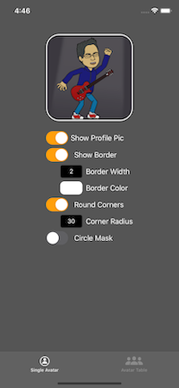

NDAvatar is a framework for displaying profile pictures or user initials in a consistent and easy way. Note that this app utilizes the NDAvatar framework which is not included in this project directly, but rather is pulled in as a Swift Package. The NDAvatar framework is also open source and available under the MIT License 

#### Build Status

| Branch  | Build Status |
| ------------- | ------------- |
| Develop  | |
| Master  | |

## Description

`NDAvatarView` is a framework combining an instance of `AvatarImageView` with custom UI options for more flexibiity.

         

`AvatarImageView` is a customisable subclass of UIImageView that is designed to show users' profile pictures. It falls back to the user's initials with a random background color if no profile picture is supplied.

`UIViewX` is a UiView extension allowing IBDesigable options for border width, border color, corner radius, and other customizations.

## Usage

#### NDAvatarApp Project

Please refer to the example project in this repository as an implementation of the framework. If you find any bugs, open a GitHub issue!

#### Gotchas

## Documentation

## Requirements

AvatarImageView requires at least iOS 12.

## Installation

## Release Notes

#### 3.0
Added Swift 5.0 support. Converted project from AvatarImageView to NDAvatar 

#### 2.2.0
Added Swift 4.2 support

#### 2.1.1
Fixed irrational test suite and test warnings

#### 2.1.0
Migrated to Swift 4

#### 2.0.3
Added a baseline offset config attribute which may be needed for custom fonts

#### 2.0.2
Fixing an issue where a profile picture may not always appear in a circle even if specified in the configuration.

#### 2.0.1
Modified `init(frame:)` to be public. Seems to have reversed from earlier by a bad merge.

#### 2.0.0
Migrated code to Swift 3.0.

#### 1.2.1
Set deployment target to 8.0. No further features or patches will be issued for Swift 2.3 after this release.

#### 1.2.0
Migrated code to Swift 2.3. 

#### 1.1.1
Modified `init(frame:)` to be public.

#### 1.1.0
Improved the random color generator. It now generates a hash from the initials and name, and then uses that as the seed to generate the random color, so it's always the same for each unique user.

#### 1.0.0
Initial Release

## Authors

Dave Glassco, [dave@neone.com](mailto:dave@neone.com)
Ayush Newatia, [ayush.newatia@icloud.com](mailto:ayush.newatia@icloud.com)
Mark Moeykens, [Big Mountain Studio](https://www.bigmountainstudio.com)

## License

NDAvatarView is available under the MIT license. See the LICENSE.md file for more info.
